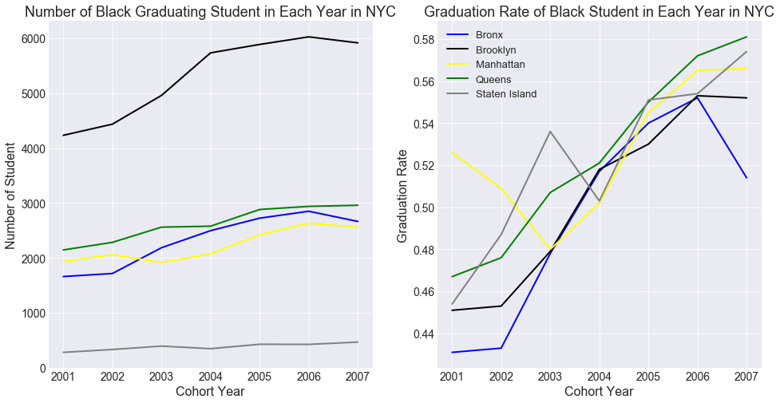

This folder is for PUI2018 Homework 8. I completed the two assignments by myself.

Assignment 1:

Figure 1. The left subplot shows the total number of black student graduating from college each year in NYC is growing contantly form 2001 to 2006. However, in 2007, this number dropped in Bronx, Manhattan, and Brooklyn. The same situation is also refleced on the right subplot. Although the graduation rate of black student in NYC is increasly significantly from 2001 to 2006, the graduation rate in Bronx, Mahattan and Brooklyn also decreased in 2017.

Assignment 2:

Authorea Report: https://www.authorea.com/335671/cs12fHGo0tE9FmxTvrw4HA