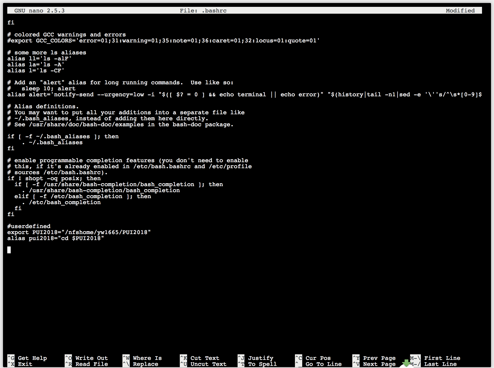
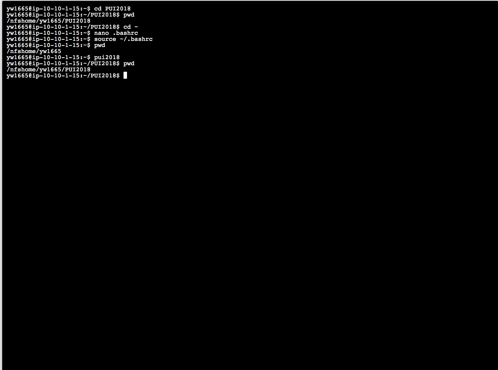

PUI2018_yw1665

This repository is created by Yuxuan Wang (NYU ID:yw1665) to display lab, assignments, and project of the Principle of Urban Informatics course provided by CUSP NYU.
  
To set up my environment, I created a environmental variable PUI2018 pointing to my PUI2018 directory, and a alias pui2018 as a short cut of the command to go to the PUI2018 directory.   

